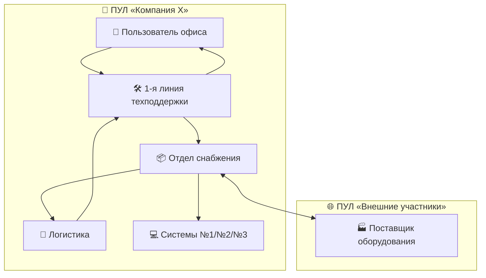
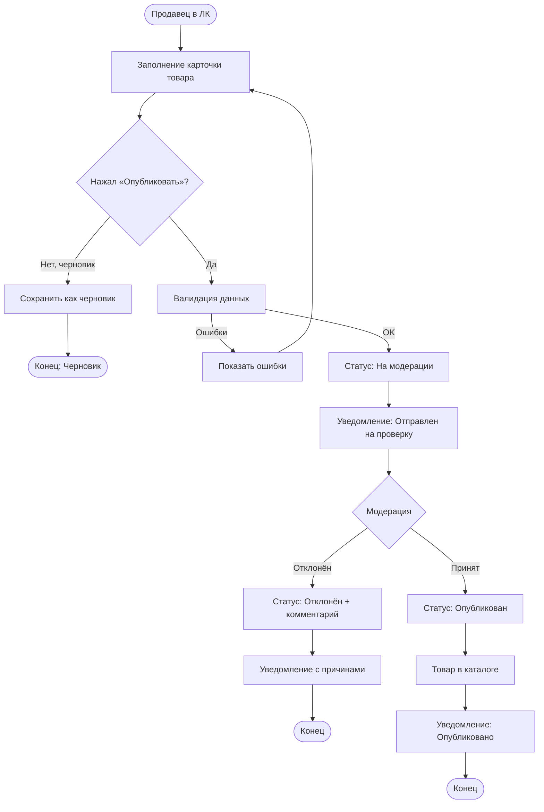

# 📋 Решение задач по бизнес-анализу

[](LICENSE)
[](https://www.bpmn.org/)
[](https://swagger.io/specification/)

> 🎯 **Цель репозитория**: Предоставить структурированные решения трёх задач по бизнес-анализу: моделирование процесса в BPMN 2.0, формулировка требований к функциональности (User Story / Use Case) и проектирование REST API для регистрации пользователя.

---

## 🗂️ Оглавление

- [Задача 1: Моделирование процесса в BPMN 2.0](#-задача-1-моделирование-процесса-выдачи-ит-оборудования-в-bpmn-20)
- [Задача 2: Требования к публикации товара](#-задача-2-требования-к-публикации-товара-на-маркетплейсе)
- [Задача 3: Регистрация пользователя — REST API](#-задача-3-регистрация-пользователя--rest-api)
- [Структура репозитория](#-структура-репозитория)
- [Лицензия](#-лицензия)

---

## 🔹 Задача 1: Моделирование процесса выдачи ИТ-оборудования в BPMN 2.0

### 📋 Структура модели «как есть»

#### Участники процесса (пулы и дорожки):



#### Ключевые элементы BPMN 2.0:

| Элемент | Обозначение | Применение в процессе |
|---------|-------------|----------------------|
| Событие старта | ○ тонкая граница | «Пользователь обратился за оборудованием» |
| Задача | ▭ прямоугольник | «Создать заявку в Системе №1» |
| Шлюз (решение) | ◇ ромб | «Оборудование есть в наличии?» |
| Промежуточное событие | ◎ двойная граница | «Заявка получена отделом снабжения» |
| Поток сообщений | ⤿ пунктир со стрелкой | Обмен между пулами |
| Артефакт (данные) | 📄 лист с углом | «Заявка №...», «Оценка сервиса» |
| Событие конца | ● жирная граница | «Заявка закрыта» |

### 🔄 Логика процесса (основной поток):

```mermaid
flowchart LR
    Start([Запрос пользователя]) --> Reg[1Л: Регистрация в Системе №1]
    Reg --> CreateReq[1Л: Заявка в Системе №2]
    CreateReq --> Notify[Снабжение: Уведомление]
    Notify --> Check{Оборудование в наличии?}
    
    Check -->|ДА| Logistics1[Вызов логистики]
    Check -->|НЕТ| Order[Заявка поставщику]
    
    Order --> Wait[Ожидание поставки]
    Wait --> Receive[Приёмка в Системе №3]
    Receive --> Logistics2[Вызов логистики → 1Л]
    
    Logistics1 --> Delivery1[Доставка в 1Л]
    Logistics2 --> Delivery2[Доставка в 1Л]
    
    Delivery1 --> Issue[1Л: Выдача пользователю]
    Delivery2 --> Issue
    
    Issue --> Close[1Л: Закрытие заявок №1 и №2]
    Close --> Rate[Пользователь: Оценка сервиса]
    Rate --> End([Конец])
```



### ⚠️ Вопросы и противоречия к описанию:

| № | Вопрос / Противоречие | Почему это важно | Рекомендация |
|---|----------------------|----------------|--------------|
| 1 | Не определены роли в системах №2/№3 | Неясно, кто выполняет задачи | Провести интервью с отделом снабжения |
| 2 | Отсутствуют сроки и SLA | Невозможно измерить эффективность | Зафиксировать нормативы времени |
| 3 | Неясна логика уведомлений | Влияет на автоматизацию | Уточнить: push, email, webhook |
| 4 | Не описаны исключения | Риск «счастливого пути» | Добавить ветки: отказ, брак, потеря |
| 5 | Дублирование закрытия заявок | Риск рассинхронизации | Определить систему-источник истины |
| 6 | Оценка сервиса не интегрирована | Обратная связь теряется | Определить место хранения оценки |
| 7 | Интеграция систем не описана | Ручной ввод = ошибки | Зафиксировать точки API-интеграции |
| 8 | Статусы заявки не детализированы | Пользователь не понимает прогресс | Определить матрицу статусов |

---

## 🔹 Задача 2: Требования к публикации товара на маркетплейсе

### 🎯 User Story

```gherkin
Feature: Публикация товара на маркетплейсе
  
  Как продавец,
  я хочу опубликовать свой товар на витрине маркетплейса,
  чтобы начать продажи и привлечь покупателей.

  Scenario: Успешная публикация товара
    Given продавец авторизован в Личном кабинете
    And у продавца есть активный договор с маркетплейсом
    When продавец заполняет карточку товара и нажимает "Опубликовать"
    And данные проходят валидацию и модерацию
    Then товар получает статус "Опубликован"
    And отображается в каталоге для покупателей
    And продавец получает уведомление об успехе
```

#### ✅ Критерии приемки:

- [ ] Продавец может заполнить карточку товара (название, описание, цена, фото, категория)
- [ ] Система проверяет обязательные поля перед публикацией
- [ ] После публикации товар отображается в каталоге для покупателей
- [ ] Продавец получает уведомление об успешной публикации
- [ ] Продавец может редактировать или снять товар с публикации
- [ ] Система ведёт лог изменений карточки товара

---

### 📋 Use Case: «Публикация товара на маркетплейсе»

| Поле | Значение |
|------|----------|
| **ID** | UC-PUB-001 |
| **Название** | Публикация товара на витрине |
| **Акторы** | Продавец (основной), Система модерации (вторичный) |
| **Предусловия** | 1. Продавец авторизован в ЛК; 2. Активный договор; 3. Есть категории товаров |
| **Постусловия** | Товар имеет статус «Опубликован» и отображается в каталоге |
| **Триггер** | Продавец нажимает кнопку «Опубликовать» |

#### Основной поток (Basic Flow):

| Шаг | Действие актора | Ответ системы |
|-----|----------------|---------------|
| 1 | Переходит в «Мои товары» → «Добавить товар» | Отображает форму карточки товара |
| 2 | Заполняет поля: название, описание, цена, категория, фото | Валидирует ввод в реальном времени |
| 3 | Нажимает «Опубликовать» | Запускает серверную валидацию |
| 4 | — | Проверяет обязательные поля, форматы, уникальность |
| 5 | — | Присваивает статус `На модерации` |
| 6 | — | Отправляет уведомление: «Товар отправлен на проверку» |
| 7 | — | Модератор (или автосистема) проверяет товар |
| 8 | — | При успехе: статус → `Опубликован`, товар в каталоге |
| 9 | — | Отправляет финальное уведомление продавцу |

#### 🔹 Альтернативные потоки:

<details>
<summary>🔽 Развернуть альтернативные сценарии</summary>

**А1: Ошибка валидации** (шаг 4 основного потока)
```
→ Система подсвечивает поля с ошибками
→ Возвращает список: { поле, код ошибки, сообщение }
→ Продавец корректирует данные и повторяет шаг 3
```

**А2: Товар не прошёл модерацию** (шаг 8 основного потока)
```
→ Система меняет статус на «Отклонён»
→ Сохраняет комментарий модератора
→ Отправляет уведомление с причинами отказа
```

**А3: Сохранение черновика** (до шага 3)
```
→ Продавец нажимает «Сохранить как черновик»
→ Система сохраняет данные со статусом «Черновик»
```
</details>

### 🗂️ Диаграмма процесса (Mermaid)



---

## 🔹 Задача 3: Регистрация пользователя — REST API

### 🔸 Задание 3.1: Описание REST API

#### 📡 Эндпоинт регистрации

```http
POST /api/v1/auth/register
Content-Type: application/json
Accept: application/json
```

#### 📥 Входные параметры (Request Body)

| Параметр | Тип | Обязательный | Ограничения | Описание |
|----------|-----|--------------|-------------|----------|
| `email` | `string` | ✅ Да | 5-100 симв., формат email, уникален | Адрес электронной почты |
| `password` | `string` | ✅ Да | 8-128 симв., 1 заглавная, 1 строчная, 1 цифра | Пароль пользователя |
| `firstName` | `string` | ✅ Да | 1-50 симв., буквы + пробелы | Имя |
| `lastName` | `string` | ✅ Да | 1-50 симв., буквы + пробелы | Фамилия |
| `phone` | `string` | ⚪ Нет | формат `+7(999)123-45-67` | Телефон для связи |
| `agreeToTerms` | `boolean` | ✅ Да | только `true` | Согласие с офертой |

#### 📤 Успешный ответ (`201 Created`)

```json
{
  "data": {
    "userId": "a1b2c3d4-e5f6-7890-g1h2-i3j4k5l6m7n8",
    "email": "user@example.com",
    "createdAt": "2026-03-16T10:30:00Z",
    "status": "pending_verification",
    "message": "Пользователь зарегистрирован. Подтвердите email."
  },
  "meta": {
    "requestId": "req_abc123",
    "timestamp": "2026-03-16T10:30:00.123Z"
  }
}
```

#### ❌ Ответ с ошибкой (`4xx` / `5xx`)

```json
{
  "error": {
    "code": "VALIDATION_ERROR",
    "message": "Некорректные данные",
    "details": [
      {
        "field": "email",
        "reason": "already_exists",
        "suggestion": "Войдите или восстановите пароль"
      }
    ],
    "requestId": "req_abc123",
    "timestamp": "2026-03-16T10:30:00.123Z"
  }
}
```

#### 🚫 Коды ошибок

| Код | Статус | Тип | Сообщение | Сценарий |
|-----|--------|-----|-----------|----------|
| `VALIDATION_ERROR` | `400` | 🔵 Клиентская | «Некорректные данные» | Не пройдена валидация |
| `EMAIL_ALREADY_EXISTS` | `409` | 🔵 Клиентская | «Пользователь с таким email уже существует» | Попытка регистрации на занятый email |
| `PASSWORD_TOO_WEAK` | `400` | 🔵 Клиентская | «Пароль не соответствует требованиям» | Слабый пароль |
| `TERMS_NOT_ACCEPTED` | `400` | 🔵 Клиентская | «Необходимо принять условия оферты» | `agreeToTerms = false` |
| `RATE_LIMIT_EXCEEDED` | `429` | 🔵 Клиентская | «Слишком много попыток» | Превышен лимит запросов |
| `INTERNAL_ERROR` | `500` | 🔴 Серверная | «Внутренняя ошибка сервера» | Ошибка БД или сервиса |

#### 🧾 OpenAPI 3.0 спецификация (YAML)

<details>
<summary>🔽 Развернуть полный фрагмент OpenAPI</summary>

```yaml
openapi: 3.0.3
info:
  title: Marketplace Auth API
  version: 1.0.0
  description: API для аутентификации и регистрации пользователей

servers:
  - url: https://api.marketplace.com/v1
    description: Production

paths:
  /auth/register:
    post:
      summary: Регистрация нового пользователя
      tags: [Authentication]
      requestBody:
        required: true
        content:
          application/json:
            schema:
              type: object
              required: [email, password, firstName, lastName, agreeToTerms]
              properties:
                email:
                  type: string
                  format: email
                password:
                  type: string
                  minLength: 8
                firstName:
                  type: string
                lastName:
                  type: string
                agreeToTerms:
                  type: boolean
      responses:
        '201':
          description: Пользователь успешно зарегистрирован
        '400':
          description: Ошибка валидации
        '409':
          description: Конфликт (email занят)
        '500':
          description: Внутренняя ошибка сервера
```
</details>

---

### 🔸 Задание 3.2: Алгоритм создания пользователя на бэкенде

#### 🔄 Пошаговая блок-схема (Mermaid Activity)

```mermaid
flowchart TD
    Start([Получение POST /register]) --> Parse[Парсинг JSON-тела]
    Parse --> ValidateStruct{Базовая валидация структуры?}
    
    ValidateStruct -->|❌ Нет| Return400[Ответ 400: INVALID_JSON]
    Return400 --> End([Конец])
    
    ValidateStruct -->|✅ Да| ValidateBiz{Бизнес-валидация}
    
    ValidateBiz -->|Email формат| CheckEmail[Проверка формата email]
    ValidateBiz -->|Password сложность| CheckPass[Проверка сложности пароля]
    ValidateBiz -->|Имя/Фамилия| CheckName[Проверка допустимых символов]
    ValidateBiz -->|agreeToTerms| CheckTerms[agreeToTerms == true?]
    
    CheckEmail & CheckPass & CheckName & CheckTerms --> BizErrors{Есть ошибки?}
    
    BizErrors -->|Да| Return400Biz[Ответ 400 с details]
    Return400Biz --> End
    
    BizErrors -->|Нет| HashPass[Хеширование пароля bcrypt/argon2]
    
    HashPass --> BeginTx[Начало транзакции БД]
    
    BeginTx --> CreateUser[Создание записи в users:]
    CreateUser -->|• userId = UUID| 
    CreateUser -->|• email = lowercase + trim|
    CreateUser -->|• password_hash|
    CreateUser -->|• status = pending_verification|
    
    CreateUser --> CreateToken[Создание токена подтверждения:]
    CreateToken -->|• token = crypto_random(32)|
    CreateToken -->|• expires_at = NOW() + 24h|
    
    CreateToken --> SendEmail[Асинхронная отправка письма]
    SendEmail -->|Очередь задач: Celery/RabbitMQ|
    
    SendEmail --> CommitTx[Фиксация транзакции]
    
    CommitTx --> LogEvent[Логирование: user_registered]
    LogEvent -->|• Без PII: пароль, полный телефон|
    
    LogEvent --> Return201[Ответ 201: Успех]
    Return201 --> End
```

#### 🔐 Критические проверки и меры безопасности

| Проверка | Зачем нужна | Реализация |
|----------|-------------|------------|
| **Rate limiting** | Защита от brute-force и спам-регистраций | Redis + token bucket, лимит: 5 запросов/мин с одного IP |
| **Уникальность email** | Предотвращение дубликатов аккаунтов | Уникальный индекс в БД + проверка до вставки |
| **Хеширование пароля** | Безопасное хранение учётных данных | bcrypt с `cost=12`, никогда не хранить в открытом виде |
| **Санитизация входных данных** | Защита от XSS и инъекций | Trim, escape, whitelist-валидация строк |
| **Асинхронная отправка писем** | Не блокировать ответ пользователю | Очередь задач (Celery / RabbitMQ / Kafka) |
| **Логирование без PII** | Аудит без нарушения приватности | Не логировать пароль, телефон маскировать: `+7***1234567` |

---

## 📁 Структура репозитория

```
📦 business-analysis-tasks/
├── 📄 README.md                 # Этот файл
├── 📄 LICENSE                   # Лицензия MIT
├── 📁 task-1-bpmn/
│   ├── 📄 process-description.md
│   └── 📄 bpmn-model.bpmn
├── 📁 task-2-requirements/
│   ├── 📄 user-stories.md
│   └── 📄 use-cases.md
├── 📁 task-3-api/
│   ├── 📄 api-spec.yaml
│   └── 📄 registration-algorithm.md
└── 📁 docs/
    ├── 📄 glossary.md
    └── 📄 assumptions.md
```

---

## 🚀 Как использовать

### 🔹 Просмотр диаграмм
```bash
# Для Mermaid-диаграмм:
# 1. Откройте файл .mermaid в редакторе с поддержкой (VS Code + расширение)
# 2. Или используйте онлайн-редактор: https://mermaid.live

# Для BPMN 2.0:
# 1. Установите Camunda Modeler: https://camunda.com/download/modeler/
# 2. Откройте файл .bpmn для редактирования или экспорта
```

### 🔹 Валидация OpenAPI спецификации
```bash
# Установка инструмента
npm install -g @redocly/cli

# Валидация spec
redocly lint task-3-api/api-spec.yaml
```

---

## 🤝 Вклад в проект

1. Fork репозитория
2. Создайте ветку для фичи: `git checkout -b feature/amazing-feature`
3. Закоммитьте изменения: `git commit -m 'Add: amazing feature'`
4. Запушьте ветку: `git push origin feature/amazing-feature`
5. Откройте Pull Request

---

## 📄 Лицензия

Распространяется под лицензией **MIT**. Подробнее см. в файле [LICENSE](LICENSE).

> 💬 **Обратная связь**:  
> Если вы нашли ошибку, неточность или у вас есть предложение по улучшению —  
> пожалуйста, создайте [Issue](../../issues) или отправьте Pull Request 🙏

<div align="center">

**Сделано с ❤️ для сообщества бизнес-аналитиков**

[⬆ Вернуться к оглавлению](#-оглавление)

</div>
